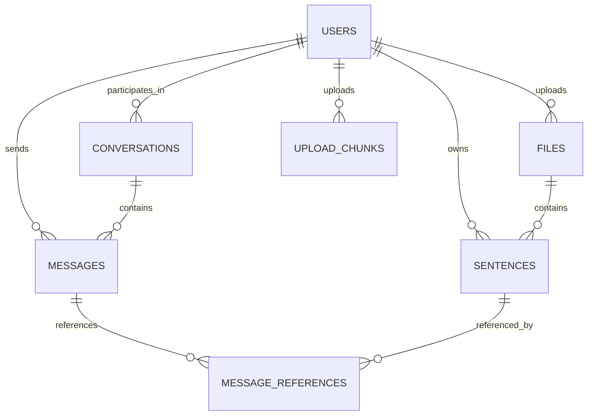

# 資料庫模型設計文檔

## 1. 概述

本文檔描述系統中使用的 SQLModel 資料庫模型和 Alembic 資料庫遷移策略。系統採用 PostgreSQL 作為主要資料庫，使用 SQLModel (基於 SQLAlchemy 2.0 和 Pydantic) 實現 ORM 映射，使用 Alembic 進行資料庫結構版本控制。

## 2. 模型結構概覽

系統的資料模型包含以下主要實體：



## 3. 資料模型詳細定義

### 3.1 使用者模型 (User)

儲存系統使用者的帳戶資訊和認證資料。

#### SQLModel 類定義

```python
class User(SQLModel, table=True):
    """
    使用者資料表模型：儲存系統使用者的帳戶資訊和認證資料
    """
    __tablename__ = "users"
    
    # 主鍵，使用UUID代替自增ID以提高安全性
    user_uuid: uuid.UUID = Field(
        default_factory=uuid.uuid4,
        primary_key=True,
        index=True,
        nullable=False
    )
    
    # 使用者認證資訊
    email: str = Field(max_length=255, index=True, unique=True, nullable=False)
    password_hash: str = Field(max_length=255, nullable=False)
    
    # 時間戳記
    created_at: datetime = Field(default_factory=datetime.utcnow, nullable=False)
    updated_at: datetime = Field(default_factory=datetime.utcnow, nullable=False)
    last_login_at: Optional[datetime] = Field(default=None)
    
    # 關聯
    files: List["File"] = Relationship(back_populates="user", sa_relationship_kwargs={"cascade": "all, delete"})
    sentences: List["Sentence"] = Relationship(back_populates="user", sa_relationship_kwargs={"cascade": "all, delete"})
    conversations: List["Conversation"] = Relationship(back_populates="user", sa_relationship_kwargs={"cascade": "all, delete"})
    messages: List["Message"] = Relationship(back_populates="user", sa_relationship_kwargs={"cascade": "all, delete"})
    upload_chunks: List["UploadChunk"] = Relationship(back_populates="user", sa_relationship_kwargs={"cascade": "all, delete"})
```

### 3.2 檔案模型 (File)

儲存使用者上傳的檔案元數據和處理狀態。

#### 狀態枚舉定義

```python
class UploadStatus(str, Enum):
    """上傳狀態枚舉"""
    PENDING = "pending"         # 等待上傳
    IN_PROGRESS = "in_progress" # 上傳中
    COMPLETED = "completed"     # 上傳完成
    FAILED = "failed"           # 上傳失敗
    TIMEOUT = "timeout"         # 上傳超時


class ProcessingStatus(str, Enum):
    """處理狀態枚舉"""
    PENDING = "pending"         # 等待處理
    IN_PROGRESS = "in_progress" # 處理中
    COMPLETED = "completed"     # 處理完成
    FAILED = "failed"           # 處理失敗
```

#### SQLModel 類定義

```python
class File(SQLModel, table=True):
    """
    檔案資料表模型：儲存使用者上傳的檔案元數據和處理狀態
    """
    __tablename__ = "files"
    
    # 主鍵
    file_uuid: uuid.UUID = Field(
        default_factory=uuid.uuid4,
        primary_key=True,
        index=True,
        nullable=False
    )
    
    # 外鍵關聯
    user_uuid: uuid.UUID = Field(foreign_key="users.user_uuid", index=True, nullable=False)
    
    # 檔案基本資訊
    original_name: str = Field(max_length=255, nullable=False)
    size_bytes: int = Field(nullable=False)
    
    # MinIO 儲存資訊
    minio_bucket_name: str = Field(max_length=100, nullable=False)
    minio_object_key: str = Field(max_length=255, nullable=False)
    
    # 檔案狀態
    upload_status: str = Field(max_length=20, default=UploadStatus.PENDING.value, nullable=False)
    processing_status: str = Field(max_length=20, default=ProcessingStatus.PENDING.value, nullable=False)
    error_message: Optional[str] = Field(default=None)
    
    # 處理結果統計
    sentence_count: int = Field(default=0)
    cd_count: int = Field(default=0)  # 概念型定義數量
    od_count: int = Field(default=0)  # 操作型定義數量
    
    # 上傳時間追踪
    upload_started_at: Optional[datetime] = Field(default=None)
    upload_completed_at: Optional[datetime] = Field(default=None)
    
    # 時間戳記
    created_at: datetime = Field(default_factory=datetime.utcnow, nullable=False)
    updated_at: datetime = Field(default_factory=datetime.utcnow, nullable=False)
    
    # 關聯
    user: "User" = Relationship(back_populates="files")
    sentences: List["Sentence"] = Relationship(back_populates="file", sa_relationship_kwargs={"cascade": "all, delete"})
```

### 3.3 句子模型 (Sentence)

儲存從 PDF 檔案中提取的句子及其分類結果。

#### 狀態枚舉定義

```python
class DefiningType(str, Enum):
    """定義類型枚舉"""
    CD = "cd"  # 概念型定義
    OD = "od"  # 操作型定義
    NONE = "none"  # 非定義型句子
```

#### SQLModel 類定義

```python
class Sentence(SQLModel, table=True):
    """
    句子資料表模型：儲存從PDF檔案中提取的句子及其分類結果
    """
    __tablename__ = "sentences"
    
    # 主鍵
    sentence_uuid: uuid.UUID = Field(
        default_factory=uuid.uuid4,
        primary_key=True,
        index=True,
        nullable=False
    )
    
    # 外鍵關聯
    file_uuid: uuid.UUID = Field(foreign_key="files.file_uuid", index=True, nullable=False)
    user_uuid: uuid.UUID = Field(foreign_key="users.user_uuid", index=True, nullable=False)
    
    # 句子內容與分類
    sentence: str = Field(nullable=False)
    page: int = Field(nullable=False)
    defining_type: str = Field(max_length=10, default=DefiningType.NONE.value)
    reason: Optional[str] = Field(default=None)
    
    # 時間戳記
    created_at: datetime = Field(default_factory=datetime.utcnow, nullable=False)
    updated_at: datetime = Field(default_factory=datetime.utcnow, nullable=False)
    
    # 關聯
    file: "File" = Relationship(back_populates="sentences")
    user: "User" = Relationship(back_populates="sentences")
    message_references: List["MessageReference"] = Relationship(back_populates="sentence", sa_relationship_kwargs={"cascade": "all, delete"})
```

### 3.4 對話模型 (Conversation)

儲存使用者的對話上下文。

#### SQLModel 類定義

```python
class Conversation(SQLModel, table=True):
    """
    對話資料表模型：儲存使用者的對話上下文
    """
    __tablename__ = "conversations"
    
    # 主鍵
    conversation_uuid: uuid.UUID = Field(
        default_factory=uuid.uuid4,
        primary_key=True,
        index=True,
        nullable=False
    )
    
    # 外鍵關聯
    user_uuid: uuid.UUID = Field(foreign_key="users.user_uuid", index=True, nullable=False)
    
    # 對話資訊
    title: str = Field(max_length=255, default="新對話")
    
    # 時間戳記
    created_at: datetime = Field(default_factory=datetime.utcnow, nullable=False)
    updated_at: datetime = Field(default_factory=datetime.utcnow, nullable=False)
    last_message_at: Optional[datetime] = Field(default=None, index=True)
    
    # 關聯
    user: "User" = Relationship(back_populates="conversations")
    messages: List["Message"] = Relationship(back_populates="conversation", sa_relationship_kwargs={"cascade": "all, delete"})
```

### 3.5 消息模型 (Message)

儲存對話中的使用者查詢和系統回應。

#### 狀態枚舉定義

```python
class MessageRole(str, Enum):
    """消息角色枚舉"""
    USER = "user"  # 使用者訊息
    ASSISTANT = "assistant"  # 系統回應
```

#### SQLModel 類定義

```python
class Message(SQLModel, table=True):
    """
    消息資料表模型：儲存對話中的使用者查詢和系統回應
    """
    __tablename__ = "messages"
    
    # 主鍵
    message_uuid: uuid.UUID = Field(
        default_factory=uuid.uuid4,
        primary_key=True,
        index=True,
        nullable=False
    )
    
    # 外鍵關聯
    conversation_uuid: uuid.UUID = Field(foreign_key="conversations.conversation_uuid", index=True, nullable=False)
    user_uuid: uuid.UUID = Field(foreign_key="users.user_uuid", index=True, nullable=False)
    
    # 消息內容
    role: str = Field(max_length=20, nullable=False)
    content: str = Field(nullable=False)
    
    # 時間戳記
    created_at: datetime = Field(default_factory=datetime.utcnow, nullable=False, index=True)
    
    # 關聯
    conversation: "Conversation" = Relationship(back_populates="messages")
    user: "User" = Relationship(back_populates="messages")
    references: List["MessageReference"] = Relationship(back_populates="message", sa_relationship_kwargs={"cascade": "all, delete"})
```

### 3.6 消息引用模型 (MessageReference)

儲存系統回應中引用的原文句子關聯。

#### SQLModel 類定義

```python
class MessageReference(SQLModel, table=True):
    """
    消息引用資料表模型：儲存系統回應中引用的原文句子關聯
    """
    __tablename__ = "message_references"
    
    # 主鍵
    reference_uuid: uuid.UUID = Field(
        default_factory=uuid.uuid4,
        primary_key=True,
        index=True,
        nullable=False
    )
    
    # 外鍵關聯
    message_uuid: uuid.UUID = Field(foreign_key="messages.message_uuid", index=True, nullable=False)
    sentence_uuid: uuid.UUID = Field(foreign_key="sentences.sentence_uuid", index=True, nullable=False)
    
    # 時間戳記
    created_at: datetime = Field(default_factory=datetime.utcnow, nullable=False)
    
    # 關聯
    message: "Message" = Relationship(back_populates="references")
    sentence: "Sentence" = Relationship(back_populates="message_references")
    
    # 資料表註釋與索引設定
    __table_args__ = (
        UniqueConstraint("message_uuid", "sentence_uuid", name="uq_message_sentence"),
        {"comment": "消息引用資料表：儲存系統回應中引用的原文句子關聯"}
    )
```

### 3.7 上傳分片模型 (UploadChunk)

追踪檔案分片上傳狀態，支援斷點續傳。

#### SQLModel 類定義

```python
class UploadChunk(SQLModel, table=True):
    """
    上傳分片資料表模型：追踪檔案分片上傳狀態，支援斷點續傳
    """
    __tablename__ = "upload_chunks"
    
    # 主鍵
    chunk_uuid: uuid.UUID = Field(
        default_factory=uuid.uuid4,
        primary_key=True,
        index=True,
        nullable=False
    )
    
    # 外鍵關聯
    user_uuid: uuid.UUID = Field(foreign_key="users.user_uuid", index=True, nullable=False)
    
    # 分片上傳資訊
    upload_id: str = Field(max_length=100, nullable=False)
    file_id: str = Field(max_length=100, nullable=False)
    chunk_number: int = Field(nullable=False)
    chunk_total: int = Field(nullable=False)
    chunk_size: int = Field(nullable=False)
    
    # MinIO 儲存資訊
    minio_bucket_name: str = Field(max_length=100, nullable=False)
    minio_object_key: str = Field(max_length=255, nullable=False)
    
    # 時間戳記
    created_at: datetime = Field(default_factory=datetime.utcnow, nullable=False)
    expires_at: datetime = Field(nullable=False, index=True)
    
    # 關聯
    user: "User" = Relationship(back_populates="upload_chunks")
```

## 4. Alembic 遷移策略

系統使用 Alembic 進行資料庫遷移管理，遵循以下原則：

1. 每個資料表都有獨立的遷移腳本
2. 遷移腳本按照關聯的依賴順序執行
3. 每個遷移腳本都提供 `upgrade()` 和 `downgrade()` 方法
4. 所有索引和約束在創建表時一併建立

### 4.1 遷移腳本順序

1. `001_create_users_table.py` - 創建使用者資料表
2. `002_create_files_table.py` - 創建檔案資料表
3. `003_create_sentences_table.py` - 創建句子資料表
4. `004_create_conversations_table.py` - 創建對話資料表
5. `005_create_messages_table.py` - 創建消息資料表
6. `006_create_message_references_table.py` - 創建消息引用資料表
7. `007_create_upload_chunks_table.py` - 創建上傳分片資料表

### 4.2 遷移腳本範例

```python
def upgrade():
    """升級：創建句子資料表和相關索引"""
    # 創建句子資料表
    op.create_table(
        'sentences',
        sa.Column('sentence_uuid', UUID(as_uuid=True), primary_key=True, default=uuid.uuid4, nullable=False),
        sa.Column('file_uuid', UUID(as_uuid=True), sa.ForeignKey('files.file_uuid', ondelete='CASCADE'), nullable=False),
        sa.Column('user_uuid', UUID(as_uuid=True), sa.ForeignKey('users.user_uuid', ondelete='CASCADE'), nullable=False),
        sa.Column('sentence', sa.Text(), nullable=False),
        sa.Column('page', sa.Integer(), nullable=False),
        sa.Column('defining_type', sa.String(10), server_default='none'),
        sa.Column('reason', sa.Text(), nullable=True),
        sa.Column('created_at', sa.TIMESTAMP(timezone=True), server_default=sa.func.now(), nullable=False),
        sa.Column('updated_at', sa.TIMESTAMP(timezone=True), server_default=sa.func.now(), nullable=False),
        
        # 約束
        sa.CheckConstraint("page > 0", name='check_positive_page'),
        sa.CheckConstraint(
            "defining_type IN ('cd', 'od', 'none')",
            name='check_valid_defining_type'
        ),
        
        # 資料表註釋
        sa.Comment('句子資料表：儲存從PDF檔案中提取的句子及其分類結果')
    )
    
    # 建立索引
    op.create_index('idx_sentences_file_uuid', 'sentences', ['file_uuid'])
    op.create_index('idx_sentences_user_uuid', 'sentences', ['user_uuid'])
    op.create_index('idx_sentences_defining_type', 'sentences', ['defining_type'])
    op.create_index('idx_sentences_page', 'sentences', ['page'])
    op.create_index('idx_sentences_user_file', 'sentences', ['user_uuid', 'file_uuid'])
    op.create_index('idx_sentences_user_defining_type', 'sentences', ['user_uuid', 'defining_type'])
    
    # 建立全文搜尋索引 (PostgreSQL特有)
    op.execute(
        'CREATE INDEX idx_sentences_sentence_tsv ON sentences USING GIN (to_tsvector(\'chinese\', sentence))'
    )


def downgrade():
    """降級：移除句子資料表"""
    # 移除資料表 (會自動移除相關的索引和約束)
    op.drop_table('sentences')
```

## 5. 實作注意事項

### 5.1 模型關係

- 所有關係都使用 SQLModel 的 `Relationship` 定義
- 一對多關係在「一」側使用 `List[]` 類型注解
- 透過 `sa_relationship_kwargs={"cascade": "all, delete"}` 實現級聯刪除

### 5.2 循環引用處理

- 使用 `TYPE_CHECKING` 條件導入避免循環引用
- 在模組初始化時透過 `update_forward_refs()` 啟用所有前向引用

### 5.3 索引策略

- 所有外鍵欄位都建立索引
- 頻繁查詢的欄位建立適當的單欄位或複合索引
- 使用 PostgreSQL 的 GIN 索引支持全文搜尋功能

### 5.4 UUID 主鍵

- 所有資料表都使用 UUID 作為主鍵，而非自增整數
- 使用 `default_factory=uuid.uuid4` 自動產生 UUID
- 提高系統安全性並便於分佈式實現

### 5.5 事務管理

- 複雜操作使用顯式事務確保資料完整性
- 資料庫與 MinIO 操作需要在同一個事務中處理
- 使用樂觀鎖處理並發衝突 